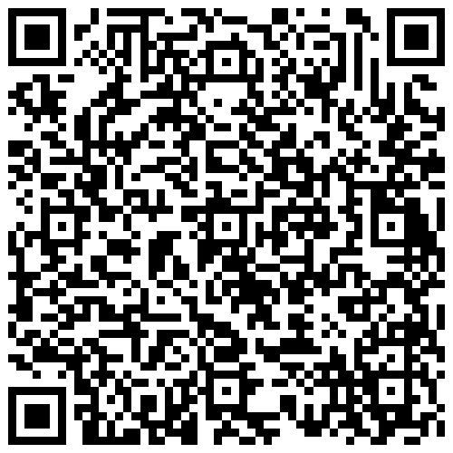
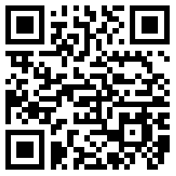
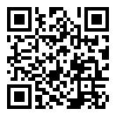

# Support the Development 🛡️

If this Docker image saved you time or helped you deploy Lokinet easily, consider buying me a coffee!

Your support encourages me to keep this project updated with the latest Lokinet releases, maintain the Docker image, and continue optimizing for low-resource environments.

**Privacy First:** Monero is preferred for maximum anonymity.

---

### 🪙 Crypto Addresses

| Currency | Network | Address & QR |
| :--- | :--- | :--- |
| **Monero**   `XMR` | Monero |  `8A2sX43G4dw7qEyN52hCv74VvpVMp9UcvL3bJi58z3ijCWfU2puHwBXhRsBjPv7ZXSbvySazcnfT4F2D8d1d4dRQDSYf1vv`   *(The only truly private way to donate)* |
| **Bitcoin**   `BTC` | Bitcoin |  `bc1qmlefz4f8eddlvdryh2zyfz0zpvc7v3nh4uh6ya`   *(Native Segwit)* |
| **Tether**   `USDT` | TRC20 |  `TYx7isaTPrWWjZPPxCKdQFRxFhvCnAeTgR` |

---

*Thank you for supporting open source privacy tools!*
